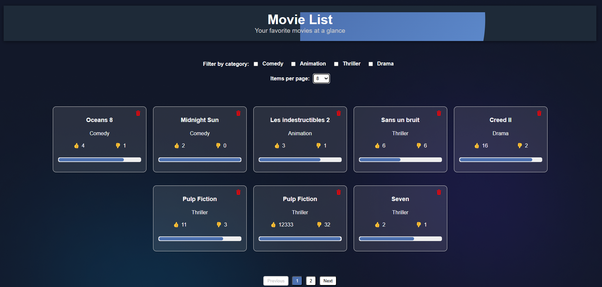

Dans le cadre de ce projet, j'ai développé une application web permettant de gérer une liste de films. Les utilisateurs peuvent filtrer les films par catégorie, et interagir avec chaque film en ajoutant des likes ou des dislikes, ainsi qu'en supprimant des films. L'application utilise Redux pour la gestion de l'état et React pour l'interface utilisateur, offrant une expérience fluide et réactive.

Vous pouvez exécuter le projet en faisant npm install puis npm start.
